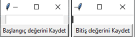
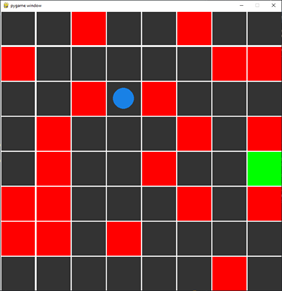
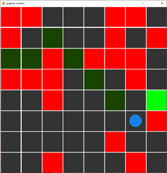

# PATH PLANNING PROJECT WITH Q-LEARNING

When the program start running we need to enter 2 inputs  1 for start point and 1 for finish point. 

Later the program puts random traps and tries to find shortest path 

After from a certain amount of try the shortest path will be drawn.
Later program saves traps to the engel.txt file. Episode via
cost and episode via steps graphs will be plotted and program terminates.
